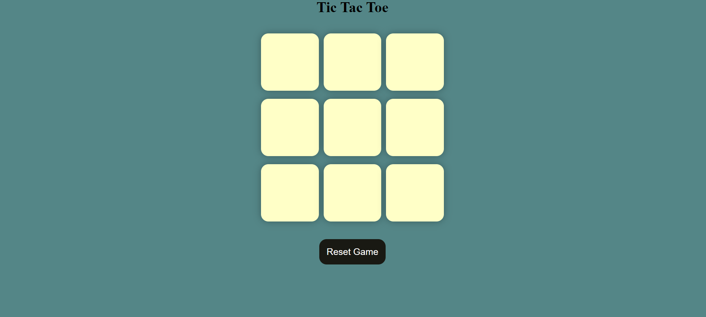

# Tic Tac Toe Game

This is a simple implementation of the classic game Tic Tac Toe using HTML, CSS, and JavaScript.

## How to Play

Open the `index.html` file in your web browser.
Players take turns clicking on empty squares to place their mark (X or O).
The first player to get three of their marks in a row (horizontally, vertically, or diagonally) wins the game.
If all squares are filled and no player has achieved a winning combination, the game ends in a draw.
Enjoy playing!

## Features

- **HTML:** Provides the structure of the game board and user interface.
- **CSS:** Styles the game for a visually appealing interface.
- **JavaScript:** Implements the game logic, including determining the winner and handling player moves.

## Preview

## Contributing

Contributions are welcome! If you have any ideas for improvements or new features, feel free to open an issue or submit a pull request.

